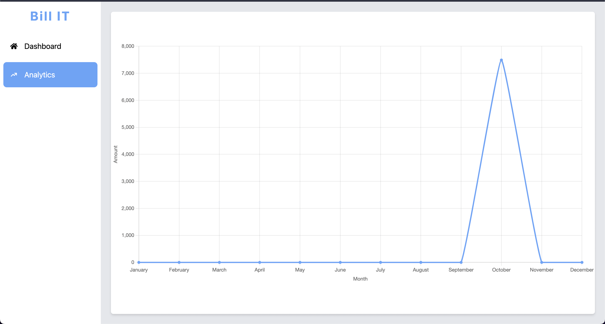
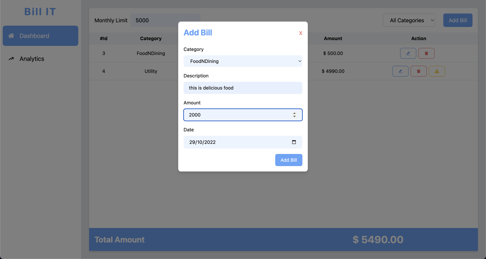
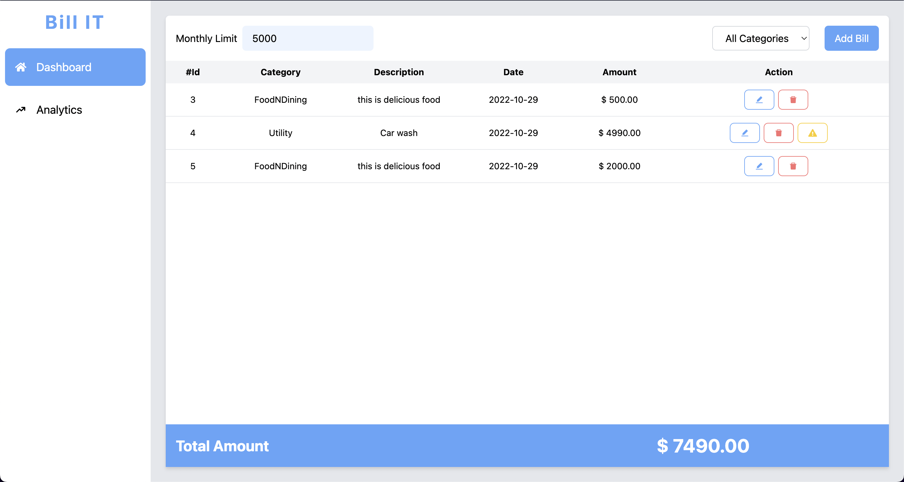

# Bill IT - React.js, Redux, Tailwind, Chart.js

(by [@jaswinderSingh](https://www.linkedin.com/in/jaswinder-singh-32a01118b/))

---

### A demo app to illustrate various features of a react.js application:

**Check the deployed app here : [Bill IT](https://bill-manager.vercel.app/dashboard).**

---

## The app uses following libraries/packages for development, build and deployment:

- **[React.js](https://reactjs.org/)** - An open-source JavaScript library for building user interfaces & single-page or mobile applications.
- **[Redux.js](https://redux.js.org/)** - A Predictable State Container for JS Apps
- **[React-Router-Dom](https://www.npmjs.com/package/react-router-dom)** - A package that provides the core routing functionality for React Router
- **[Chart.js](https://www.chartjs.org/)** - an open-source JavaScript library to draw different types of charts by using the HTML5 canvas element
- **[Vercel](https://vercel.com/)** - for Instant static deploys
- **[TypeScript](https://github.com/Microsoft/TypeScript)** - a superset of JavaScript programming language that compiles to clean JavaScript output.
- **[Tailwindcss](https://www.npmjs.com/package/tailwindcss)** - A utility-first CSS framework for rapidly building custom user interfaces.
- **[React-Icons](https://www.npmjs.com/package/react-icons)** - Include popular icons in your React projects easily with react-icons, which utilizes ES6 imports that allows you to include only the icons that your project is using.
- **[clsx](https://www.npmjs.com/package/clsx)** - A tiny (228B) utility for constructing className strings conditionally.Also serves as a faster & smaller drop-in replacement for the classnames module.

## Functional requirements:

**LEVEL-1:**

- The user must be able to manually add, edit and remove bills. (update the state locally)
- The user must be able to filter bills by category. (category filter dropdown)
- Draw a time-series chart of the monthly billing cycle.

**LEVEL-2:**

- Adithya wants to be able to see a minimum number of bills that should be paid (n), such that their
  total value does not exceed the monthly budget value while meeting the condition that no more bills
  can be added from the remaining bills.. Highlight all the bills that should be paid.

---

## Screenshots:

1. **Analytics** - Shows monthly bills in a graph

2. **Create/Edit Bill** - Create or edit bills on this screen using a simple form

3. **List all Bills** - Show a list of bills with features like add, edit and delete. Also show a warning to pay the when total value exceeds the monthly limit.

# Getting Started with Create React App

This project was bootstrapped with [Create React App](https://github.com/facebook/create-react-app).

## Available Scripts

In the project directory, you can run:

### `yarn start`

Runs the app in the development mode.\
Open [http://localhost:3000](http://localhost:3000) to view it in the browser.

The page will reload if you make edits.\
You will also see any lint errors in the console.

### `yarn test`

Launches the test runner in the interactive watch mode.\
See the section about [running tests](https://facebook.github.io/create-react-app/docs/running-tests) for more information.

### `yarn build`

Builds the app for production to the `build` folder.\
It correctly bundles React in production mode and optimizes the build for the best performance.

The build is minified and the filenames include the hashes.\
Your app is ready to be deployed!

See the section about [deployment](https://facebook.github.io/create-react-app/docs/deployment) for more information.

### `yarn eject`

**Note: this is a one-way operation. Once you `eject`, you can’t go back!**

If you aren’t satisfied with the build tool and configuration choices, you can `eject` at any time. This command will remove the single build dependency from your project.

Instead, it will copy all the configuration files and the transitive dependencies (webpack, Babel, ESLint, etc) right into your project so you have full control over them. All of the commands except `eject` will still work, but they will point to the copied scripts so you can tweak them. At this point you’re on your own.

You don’t have to ever use `eject`. The curated feature set is suitable for small and middle deployments, and you shouldn’t feel obligated to use this feature. However we understand that this tool wouldn’t be useful if you couldn’t customize it when you are ready for it.

## Learn More

You can learn more in the [Create React App documentation](https://facebook.github.io/create-react-app/docs/getting-started).

To learn React, check out the [React documentation](https://reactjs.org/).
